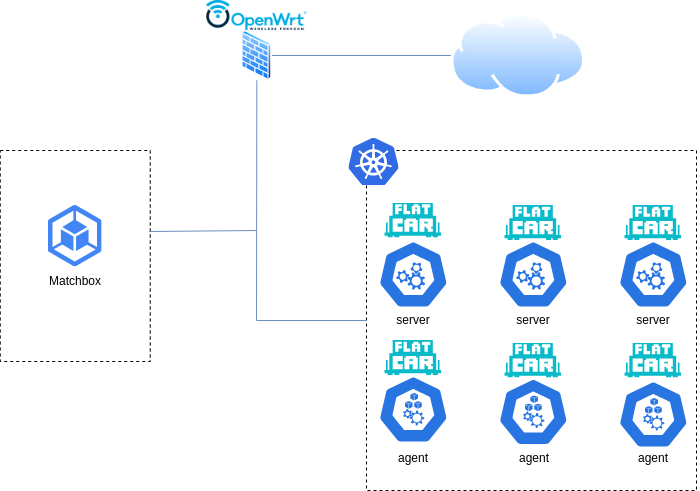

# Metal as code with k3s

Metal as code with k3s is a solution for installing kubernetes on baremetal using code.

## What is this

This project aims to automate the deployment of Flatcar Container Linux (Flatcar OS) with a Kubernetes cluster using k3s via PXE boot. We'll use the Matchbox solution for managing PXE boot configurations and Terraform for infrastructure as code (IAC) to define and provision the required resources.


## Prerequisites

Before getting started, ensure you have the following prerequisites installed on your development machine:

1. [Terraform](https://www.terraform.io/downloads.html)
2. [Matchbox](https://github.com/poseidon/matchbox)
3. [Docker](https://docs.docker.com/engine/install/)
4. [PXE-capable infrastructure](https://matchbox.psdn.io/network-setup/) (eg., dnsmask)

## Design
This is an example of archicture.

To have a pxe capable infrascture we use [openwrt firwall](https://openwrt.org/).



openwrt used to
- configure dhcp to redirect boot pxe to matchbox
- configure static lease 

## Getting Started

Follow these steps to set up and deploy Flatcar OS with k3s:

### 1. Clone the Repository

Clone this repository to your machine:

```bash
git clone https://github.com/hmei28/Metal-as-code-k3s.git
cd Metal-as-code-k3s
```

### 2. Download iso flatcar
```
./scripts/get-flatcar stable 3510.2.7 ./config/assets
```

### 3. Configure matchbox

- Generate certificat matchbox
```sh
export SAN=DNS.1:matchbox.example.com,IP.1:192.168.X.X,IP.2:172.16.X.X
cd tls/
./cert-gen

```

- Go to the root folder and run matchbox
```sh
sudo docker run --net=host --name matchbox -d --rm -v $PWD/config:/var/lib/matchbox:Z -v $PWD/tls:/etc/matchbox:Z,ro quay.io/poseidon/matchbox:v0.10.0 -address=0.0.0.0:8080 -rpc-address=0.0.0.0:8081 -log-level=debug
```

- Copy client key to connect on matchbox
```sh
cp tls/client.* tls/ca.crt ~/.matchbox
```

- Test connexion
```sh
openssl s_client -connect matchbox.example.com:8081 \
-CAfile ~/.matchbox/ca.crt \
-cert ~/.matchbox/client.crt \
-key ~/.matchbox/client.key
```
### 4. Deploy with terraform

- Go to terraform folder, copy the template variable  
```sh
cd terraform/
cp terraform.tfvars.example terraform.tfvars
```

- Edit configuration on terraform.tfvars

- init terraform and apply if good
```sh
terraform init
terraform apply
```
## Boot server

- Boot pxe the first server you spécify on terraform variable.
- After k2s installed on the first server you can boot pxe other agent and server

## Testing your cluster kube

Once deployement of OS and K3s is complete, acces to the first server k3s via ssh.
You can now verify the kube installation:

```sh
sudo KUBECONFIG=/etc/rancher/k3s/k3s.yaml  /opt/bin/kubectl get node
```